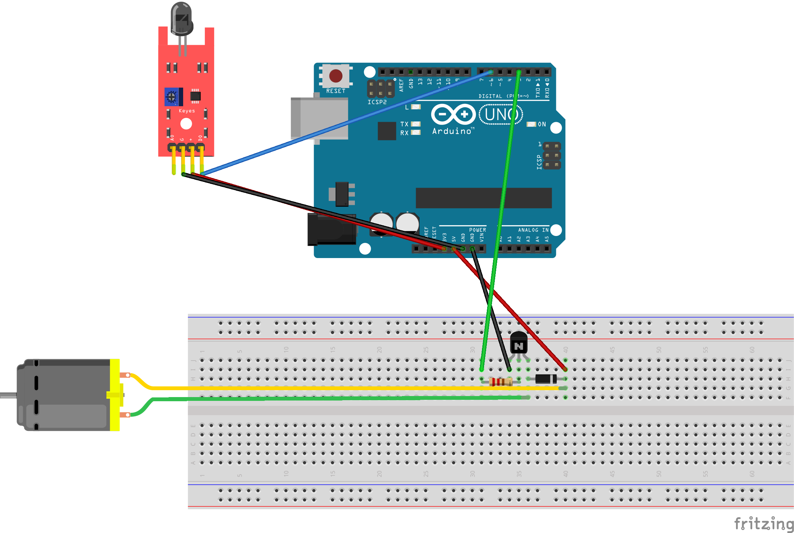

# candle-blower
An Arduino robot that blows birthday cake candles out in order to help prevent the spread of COVID-19

  

## Table of contents
* [Components](#components)
* [Wiring diagram](#wiring-diagram)
* [License](#license)
## Components
- Arduino Uno x1
- Flame sensor x1
- NPN transistor x1
- 220Ω (ohms) resistor x1
- Diode x1
- Jumper wires male to female x5
- Jumper wires male to male x3
## Wiring diagram

## License
This project is licensed under the MIT License - open the [LICENSE.md](https://github.com/LFuciarelli/candle-blower/blob/main/LICENSE) file for more details
